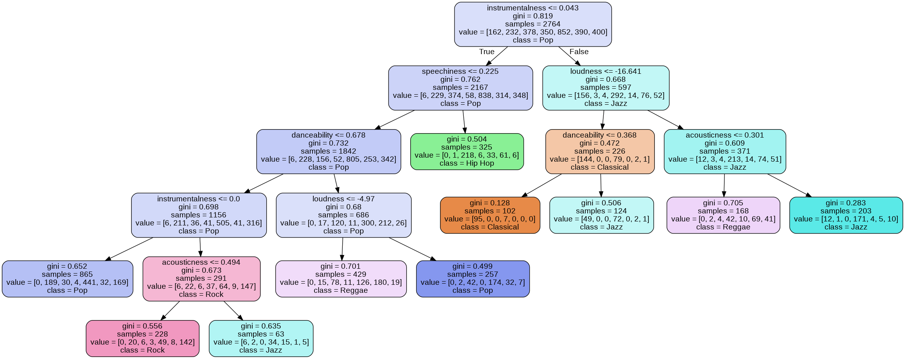

# Tree-Based Methods: Prediction of Song Genre Based on Audio Features

Audio Features
1. Energy
2. Danceability
3. Acousticness
4. Instrumentalness
5. Loudness
6. Valence
7. Speechiness
8. Tempo
9. Liveness

There are seven genres in the data:
1. Classical
2. Country
3. Hip Hop
4. Jazz
5. Pop
6. Rock
7. Reggae

My classification tree has an accuracy of 58% without varying any parameters. The accuracy increased to  64% following cost-complexicity pruning. However, the tree was still too complex. After adjusting the minimum decrease in impurity before node splitting, the tree becomes interpretable at the cost of a decrease in accuracy (64% down to 57%):

Precision and recall scores can be found in *predictingSongGenre.ipynb*. In particular, the model performs poorly in correctly predicting country music.

