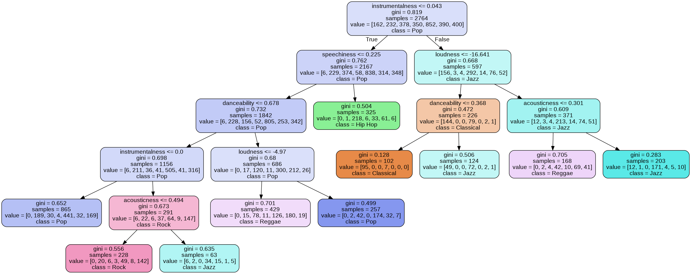

## Tree-Based Methods for Predicting the Genre of a Song Based on Audio Features

The data in this repository consists of 3900+ songs from Spotify among nine genres with information on the following audio features:

1. Energy
2. Danceability
3. Acousticness
4. Instrumentalness
5. Loudness
6. Valence
7. Speechiness
8. Tempo
9. Liveness

Based on these audio features, I optimized two tree-based models to predict the genre of a song. If you would like to learn more about the aforementioned metrics, please go to

https://developer.spotify.com/documentation/web-api/reference/tracks/get-audio-features/

### Model 1: Classification Tree

Without pruning or adjustment of any stopping criterions, the "baseline" tree has an accuracy of 58%. In that regard, model accuracy increased to 64% following cost-complexicity pruning; but the tree was still too complex. After adjusting the minimum decrease in impurity before node splitting (a stopping criterion), the tree becomes interpretable at the cost of a decrease in accuracy (64% down to 57%):

### Model 2:  Random Forest

By creating multiple classification trees from bootstrapped training sets, predictions are made through majority votes taken among the resulting trees. At each split, a random subset of the nine features are randomly considered. This approach increased accuracy to 71% at the cost of a complete loss of interpretability. 

### Which model is more insightful?
It's simply a fact that genres of music are not necessarily independent of each other. Although the random forest is more accurate, the decision tree has more value by virtue of interpretability. This is not always the case, so I nonetheless learned how to implement random forests. The notes folder contains the notes I took from *An Introduction to Statistical Learning with Applications in R* to properly use tree-based methods for making predictions.  However, note that my models were created in Python instead of R. 

Reminder: The libraries *PyDotPlus* and *GraphViz* visualize decision trees. *GraphViz* must be added to the computer's PATH environment variable, or else Python will return the following error: "GraphViz's executables not found."
